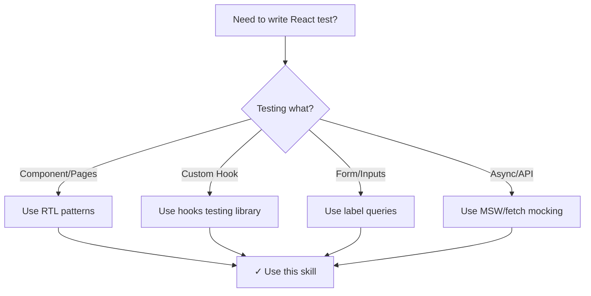
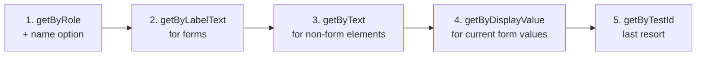

# React Testing

## Overview

Write React tests that focus on user behavior and accessibility rather than implementation details. Follow testing principles that make tests resilient to refactoring and meaningful to actual users.

## When to Use



**Use when:**
- Testing React components, pages, or hooks
- Uncertain about proper query methods (getByRole vs getByText vs getByTestId)
- Structuring test files (describe blocks, naming conventions)
- Setting up test utilities (providers, mocks)
- Testing forms, user interactions, or async behavior
- Mocking APIs, providers, or external dependencies

**Don't use when:**
- Testing pure TypeScript/JavaScript functions (use Jest directly)
- Testing backend code (use backend testing patterns)
- Testing build processes or configuration files

## Core Pattern: User-Centric Testing

**❌ Testing Implementation Details:**
```tsx
// BAD - Tests internal state and props
it('should have className prop applied', () => {
  render(<Button className="primary" />);
  expect(screen.getByRole('button')).toHaveClass('primary');
});
```

**✅ Testing User Behavior:**
```tsx
// GOOD - Tests what user experiences
describe('Button', () => {
  it('should handle click', async () => {
    const handleClick = vi.fn();
    const user = userEvent.setup();
    
    render(<Button onClick={handleClick}>Submit</Button>);
    
    await user.click(screen.getByRole('button', { name: /submit/i }));
    expect(handleClick).toHaveBeenCalledTimes(1);
  });
});
```

## Query Priority Guide

Use this hierarchy for element selection:



**Query Selection Guidelines:**

| Priority | Query | When to Use | Example |
|----------|-------|-------------|---------|
| 1 | `getByRole` | Most accessible queries | `screen.getByRole('button', { name: /submit/i })` |
| 2 | `getByLabelText` | Form inputs with labels | `screen.getByLabelText('Email')` |
| 3 | `getByText` | Non-interactive elements | `screen.getByText('Success message')` |
| 4 | `getByDisplayValue` | Current form values | `screen.getByDisplayValue('john@example.com')` |
| 5 | `getByTestId` | Dynamic text or no match | `screen.getByTestId('user-id-123')` |

**Anti-patterns:**
```tsx
// ❌ getByTestId as default choice
expect(screen.getByTestId('submit-button')).toBeDisabled();

// ❌ Desctructuring render
const { getByText } = render(<Component />);
expect(getByText('Hello')).toBeInTheDocument();

// ❌ Container queries
const { container } = render(<Component />);
expect(container.querySelector('.my-class')).toBeInTheDocument();
```

## Naming Convention

**REQUIRED Test Structure:**

```tsx
describe('ComponentName', () => {
  it('should use case sentence for test description', () => {
    // Test happy path
  });

  describe('when specific scenario', () => {
    it('should handle this specific case', () => {
      // Test scenario
    });
  });

  describe('when another scenario', () => {
    it('should handle that case', () => {
      // Test scenario
    });
  });
});
```

**Rules:**
1. Root `describe` = Component/Page/Hook name exactly
2. Nested `describe` = Must start with "when" prefix
3. Test descriptions = Use case sentence format

## Test Utilities Setup

**Create `src/__tests__/test-utils.tsx`:**

```tsx
import { ReactElement } from 'react';
import { render, RenderOptions } from '@testing-library/react';
import userEvent from '@testing-library/user-event';

// Mock all providers (Chakra, SWR, Context, etc.)
const AllProviders = ({ children }: { children: React.ReactNode }) => {
  return (
    <YourProvider>
      <AnotherProvider>
        {children}
      </AnotherProvider>
    </YourProvider>
  );
};

const customRender = (
  ui: ReactElement,
  options?: Omit<RenderOptions, 'wrapper'>
) => render(ui, { wrapper: AllProviders, ...options });

// Re-export everything
export * from '@testing-library/react';

// Override render method
export { customRender as render };
export { userEvent };
```

**Usage:**
```tsx
import { render, screen, userEvent } from '@/__tests__/test-utils';

describe('MyComponent', () => {
  it('should work with providers', () => {
    render(<MyComponent />);
    // Component has access to all providers
  });
});
```

## Mocking Strategies

**Mocking Dependencies:**

```tsx
// Mock external components
jest.mock('components/Button', () => ({
  Button: jest.fn(({ children }) => <button>{children}</button>),
}));

// Mock hooks
jest.mock('hooks/useAuth', () => ({
  useAuth: jest.fn(() => ({ user: null, loading: false })),
}));

// Mock API calls with MSW
import { rest } from 'msw';
import { setupServer } from 'msw/node';

const server = setupServer(
  rest.get('/api/users', (req, res, ctx) => {
    return res(ctx.json([{ id: 1, name: 'Test' }]));
  })
);

beforeAll(() => server.listen());
afterEach(() => server.resetHandlers());
afterAll(() => server.close());
```

**Mocking Fetchers:**
```tsx
describe('fetchUser', () => {
  it('should return user data', async () => {
    const mockStore = new AppCollection();
    const mockUser = mockStore.add({}, User);
    
    mockStore.request = jest.fn().mockResolvedValue({ data: mockUser });
    
    const result = await fetchUser(mockStore, '1');
    expect(result).toBeInstanceOf(User);
  });
});
```

## Component Testing Patterns

**Forms and Inputs:**
```tsx
describe('UserForm', () => {
  it('should submit with valid data', async () => {
    const handleSubmit = vi.fn();
    const user = userEvent.setup();
    
    render(<UserForm onSubmit={handleSubmit} />);
    
    await user.type(screen.getByLabelText('Name'), 'John');
    await user.type(screen.getByLabelText('Email'), 'john@example.com');
    await user.click(screen.getByRole('button', { name: /submit/i }));
    
    expect(handleSubmit).toHaveBeenCalledWith({
      name: 'John',
      email: 'john@example.com'
    });
  });

  describe('when form has validation errors', () => {
    it('should display error message', async () => {
      const user = userEvent.setup();
      
      render(<UserForm onSubmit={vi.fn()} />);
      
      await user.click(screen.getByRole('button', { name: /submit/i }));
      
      expect(screen.getByRole('alert')).toHaveTextContent('Name and email are required');
    });
  });
});
```

**States and Conditions:**
```tsx
describe('UserForm', () => {
  describe('when loading', () => {
    it('should disable submit button', () => {
      render(<UserForm onSubmit={vi.fn()} loading={true} />);
      
      expect(screen.getByRole('button')).toBeDisabled();
      expect(screen.getByRole('button')).toHaveTextContent(/submitting/i);
    });
  });

  describe('when not loading', () => {
    it('should enable submit button', () => {
      render(<UserForm onSubmit={vi.fn()} loading={false} />);
      
      expect(screen.getByRole('button')).not.toBeDisabled();
    });
  });
});
```

## Hook Testing

**Use `@testing-library/react-hooks`:**

```tsx
import { renderHook, waitFor } from '@testing-library/react';

describe('useAuth', () => {
  it('should toggle loading state', async () => {
    const { result } = renderHook(() => useAuth());
    
    await waitFor(() => {
      result.current.toggleLoading();
    });
    
    expect(result.current.loading).toBe(true);
  });

  describe('when user exists', () => {
    it('should return user object', () => {
      const { result } = renderHook(() => useAuth({ user: mockUser }));
      
      expect(result.current.user).toEqual(mockUser);
    });
  });
});
```

## Page Testing

**Test All States:**

```tsx
describe('UserPage', () => {
  it('should render error page', async () => {
    (fetchUsers as jest.Mock).mockRejectedValue(new Error('Failed'));
    
    render(<UserPage />);
    
    expect(await screen.findByTestId('error-page')).toBeInTheDocument();
  });

  it('should render loading page', async () => {
    (fetchUsers as jest.Mock).mockResolvedValue(null);
    
    render(<UserPage />);
    
    expect(await screen.findByTestId('loading-page')).toBeInTheDocument();
  });

  it('should render user data', async () => {
    (fetchUsers as jest.Mock).mockResolvedValue([mockUser]);
    
    render(<UserPage />);
    
    expect(await screen.findByText('Test User')).toBeInTheDocument();
  });
});
```

## Folder Structure

```
src/
├── __tests__/
│   ├── test-utils.tsx          # Custom render with providers
│   └── pages/                  # Next.js page tests
│       └── user.test.tsx
├── components/
│   └── Button/
│       ├── Button.tsx
│       └── Button.test.tsx     # Test next to component
├── hooks/
│   └── useAuth/
│       ├── useAuth.ts
│       └── useAuth.test.ts     # Test next to hook
└── fetchers/
    └── users/
        ├── users.ts
        └── users.test.ts       # Test next to fetcher
```

**Exception:** Next.js `pages/` folder - tests go in `src/__tests__/pages/`

## Common Mistakes

| Mistake | Why Bad | Fix |
|---------|---------|-----|
| Testing internal state | Breaks on refactoring | Test user behavior instead |
| Overusing getByTestId | Not accessible | Use getByRole/getByLabelText |
| Destructuring render | Loses debug benefits | Use screen object |
| Too many rendering tests | Low value, brittle | Test interactions instead |
| Testing implementation | Not meaningful to users | Test what users experience |

**Avoid "is rendering" tests:**

```tsx
// ❌ Unnecessary rendering test
it('should render button', () => {
  render(<Button />);
  expect(screen.getByRole('button')).toBeInTheDocument();
});

// ✅ Test actual functionality instead
it('should handle click', async () => {
  const handleClick = vi.fn();
  const user = userEvent.setup();
  
  render(<Button onClick={handleClick}>Click</Button>);
  await user.click(screen.getByRole('button'));
  
  expect(handleClick).toHaveBeenCalledTimes(1);
});
```

## Quick Reference

**User Events:**
```tsx
const user = userEvent.setup();
await user.click(element);
await user.type(element, 'text');
await user.clear(element);
await user.tab();
```

**Common Queries:**
```tsx
screen.getByRole('button', { name: /submit/i })
screen.getByLabelText('Email')
screen.getByText('Success')
screen.queryByRole('alert') // Returns null if not found
screen.findByText('Loading') // Async, waits for element
```

**Common Assertions:**
```tsx
expect(element).toBeInTheDocument();
expect(element).toBeDisabled();
expect(element).toHaveTextContent('text');
expect(element).toHaveClass('class-name');
expect(mockFn).toHaveBeenCalledTimes(1);
```

## Implementation

**Setup Dependencies:**
```bash
pnpm add -D @testing-library/react @testing-library/user-event @testing-library/jest-dom vitest
pnpm add -D @testing-library/react-hooks # For hook testing
pnpm add -D msw msw/node # For API mocking
```

**Vitest Config:**
```javascript
// vitest.config.ts
import { defineConfig } from 'vitest/config';
import react from '@vitejs/plugin-react';

export default defineConfig({
  plugins: [react()],
  test: {
    globals: true,
    environment: 'jsdom',
    setupFiles: './src/__tests__/setup.ts',
  },
});
```

**Setup File:**
```typescript
// src/__tests__/setup.ts
import '@testing-library/jest-dom';
import { cleanup } from '@testing-library/react';
import { afterEach } from 'vitest';

afterEach(() => {
  cleanup();
});
```